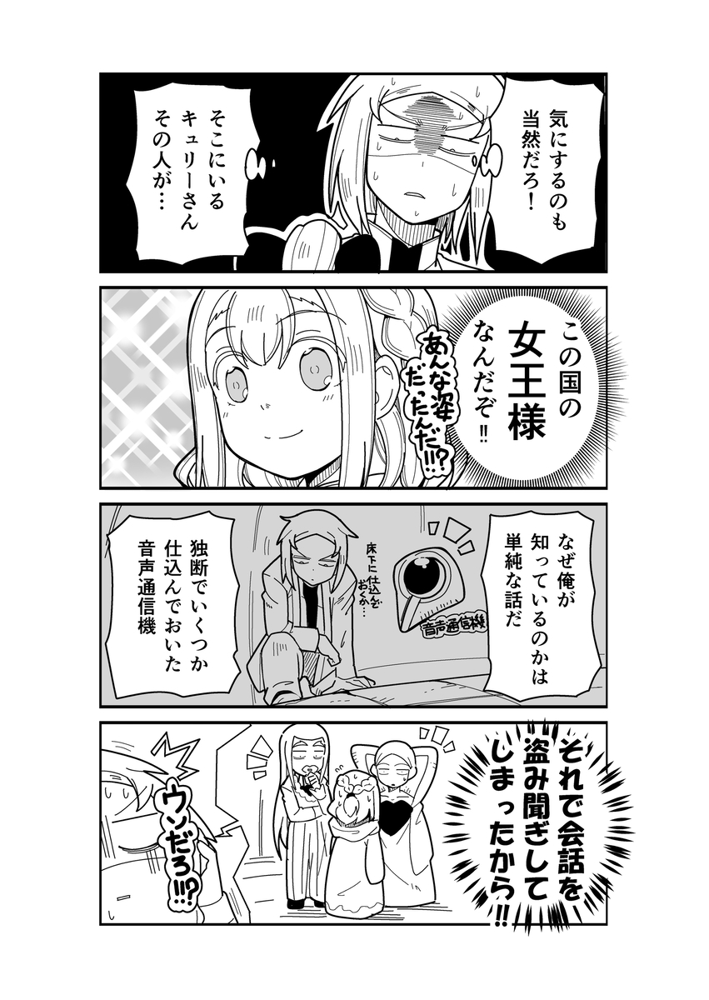
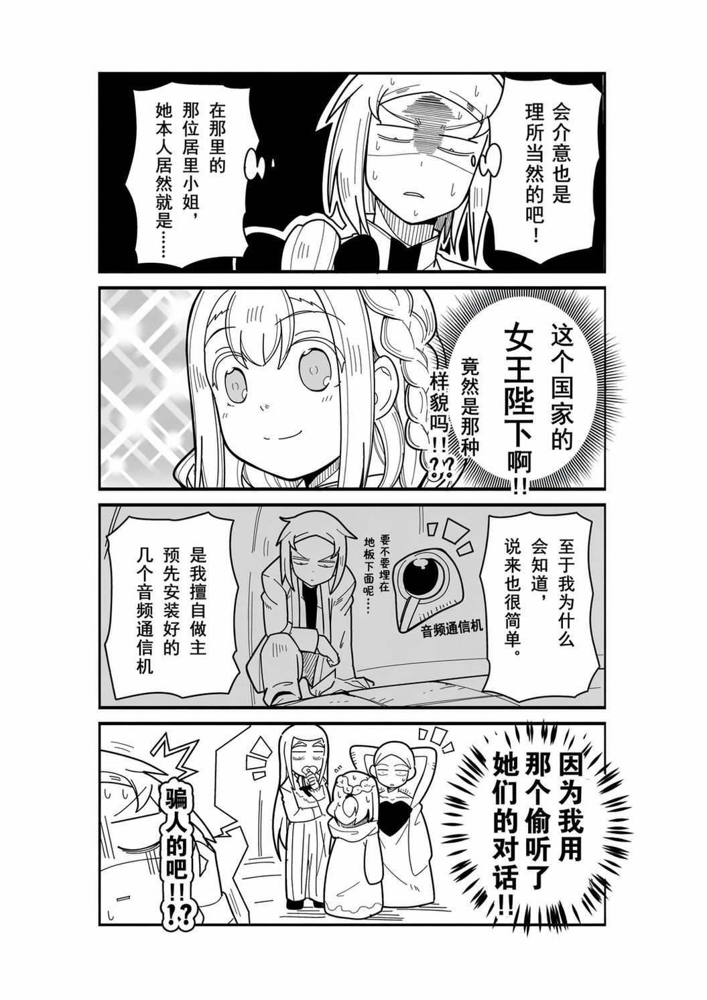

<div align="center">

# ComicLens

[](https://www.electronjs.org/)
[](https://react.dev/)
[](https://www.typescriptlang.org/)
[](https://tailwindcss.com/)
[](https://daisyui.com/)
[](LICENSE)
[](https://github.com/)

AI 驱动的漫画翻译桌面应用。通过视觉识别、智能翻译和图片生成，一键完成漫画本地化。

</div>

---

## Features

| | 功能 | 说明 |
|---|---|---|
| :art: | **4 阶段翻译流水线** | 识图 → 全局分析 → 逐页翻译 → 图片生成 |
| :electric_plug: | **多 API 支持** | OpenAI / Anthropic，自由切换 |
| :control_knobs: | **自动 / 手动模式** | 手动模式可在每阶段暂停审核 |
| :bar_chart: | **实时进度追踪** | 每页状态可视化 + 全局翻译日志 |
| :framed_picture: | **3 栏工作区** | 缩略图导航 / 图片查看器 / 详情编辑 |
| :pencil2: | **可编辑翻译** | 手动修改翻译结果后重新生图 |
| :zap: | **异步缩略图** | 导入时后台生成，不阻塞 UI |
| :art: | **主题切换** | 浅色 / 深色主题 |
| :memo: | **自定义提示词** | 支持模板变量，灵活控制翻译质量 |

## Screenshots

<div align="center">

| 原图 | 翻译后 |
|:---:|:---:|
|  |  |

</div>

## Quick Start

### 环境要求


### 开发

```bash
# 克隆项目
git clone https://github.com/monaican/comic-lens.git
cd comic-lens

# 安装依赖
pnpm install

# 启动开发模式
pnpm run dev
```

### 构建 & 打包

```bash
# 构建生产版本
pnpm run build

# 打包 Windows 安装包 (输出到 dist/)
pnpm run pack
```

## Tech Stack

<div>

| 层级 | 技术 |
|:---:|---|
| **框架** |   |
| **语言** |  |
| **样式** |   |
| **数据库** |  (better-sqlite3) |
| **图片处理** |  |
| **构建** |   |
| **图标** |  |

</div>

## Architecture

```
src/
├── main/                    # Electron 主进程
│   ├── index.ts               窗口管理、应用入口
│   ├── database.ts            SQLite 数据库操作
│   ├── config.ts              配置文件读写
│   ├── ipc.ts                 IPC 通信处理
│   ├── translate-pipeline.ts  4 阶段翻译流水线
│   ├── vision-service.ts      视觉识别 API
│   ├── reasoning-service.ts   推理/翻译 API
│   ├── image-gen-service.ts   图片生成 API
│   └── thumbnail-service.ts   缩略图生成
├── preload/                 # Preload 脚本
│   └── index.ts               contextBridge API
└── renderer/                # React 渲染进程
    ├── components/            UI 组件
    ├── hooks/                 React Hooks
    ├── types.ts               TypeScript 类型
    └── assets/                样式文件
```

### 翻译流水线

```
┌─────────┐    ┌──────────┐    ┌──────────┐    ┌──────────┐
│  识图    │ →  │ 全局分析  │ →  │ 逐页翻译  │ →  │ 图片生成  │
│ Vision   │    │ Analysis  │    │ Translate │    │ ImageGen  │
└─────────┘    └──────────┘    └──────────┘    └──────────┘
  并发处理        单次调用         并发处理         并发处理
```

## Configuration

首次启动后在「设置」页面配置：

| 配置项 | 说明 | 推荐 |
|---|---|---|
| 视觉模型 | 识别漫画页面内容 | gemini-3-flash |
| 推理模型 | 全局分析 + 逐页翻译 | gemini-3-flash |
| 图片生成模型 | 生成翻译后图片 | gpt-image-2(暂时只支持codex /v1/response逆向接口) |
| 并发数 | 同时处理页数 | 3-5 |
| 提示词模板 | 支持变量替换 | 留空使用默认 |

模板变量：`{source_lang}` `{target_lang}` `{master_prompt}` `{refined}`

## License

[MIT](LICENSE)

---

<div align="center">

Made with :blue_heart: by ComicLens

</div>
